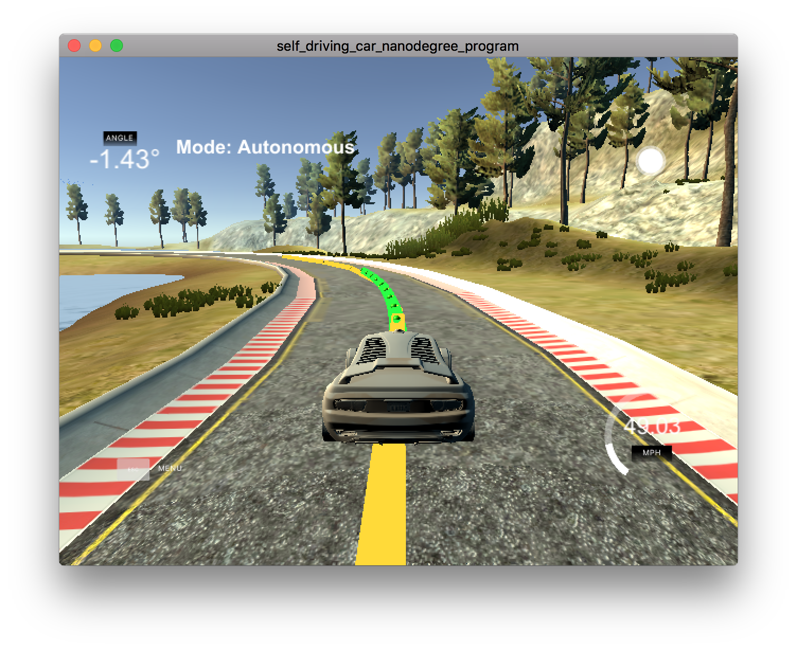

# Reflection on Model Predictive Control Project
In this project, a Model Predictive Controller was built to steer the car on the track in the simulator.  The simulator will provide position, heading, speed, and trajectory reference of the car for the MPC.



## The Vehicle Model
The model used in this project is a non-linear kinematic model:

```
x_[t+1] = x[t] + v[t] * cos(psi[t]) * dt
y_[t+1] = y[t] + v[t] * sin(psi[t]) * dt
psi_[t+1] = psi[t] + v[t] / Lf * delta[t] * dt
v_[t+1] = v[t] + a[t] * dt
cte[t+1] = f(x[t]) - y[t] + v[t] * sin(epsi[t]) * dt
epsi[t+1] = psi[t] - psides[t] + v[t] * delta[t] / Lf * dt
```
`x` and `y` represent the position of the car. `psi` is the heading. `Lf` represents the maneuverability of the car in the simulator. `v` stands for the speed. `delta` and `a`, i.e. steering angle and acceleration, are the actuators in this model.

The cross track error is estimated by the difference between reference trajectory and current position plus offset from the previous state. The error in the heading is the difference between the tangent line to the reference trajectory and current heading plus offset from the previous state.

The cost function is calculated like below:

```
cost = sum(cte[t] ^ 2 + 
           epsi[t] ^ 2 + 
           (v[t] - v_ref) ^ 2 + 
           delta[t] ^ 2 + a[t] ^ 2 + 
           500 * (delta[t + 1] - delta[t]) ^ 2 + 
           (a[t + 1] - a[t]) ^ 2;
```

The `500` will give more penalty in the cost of the gap between consecutive steering control to smooth steering transitions.

## Timestep Length and Elapsed Duration (N & dt)
The final choice of timestep length and elapsed duration are shown below:

```
size_t N = 13;
double dt = 0.05;
```
At first, I used 25 for my N value. It was doing well. With `dt` is equal to 0.05 second, this means that I have the prediction for the next 1.25 second. Consider the target latency is 200 ms, I suppose I don't need that much time steps. So I shrank the value to 13, and it was doing good too.

## Polynomial Fitting and MPC Preprocessing

Before derivating the reference trajectory, I transformed the reference points from global frame to local frame.

```
// To transform from world coordinate to vehicle coordinate
vector<Eigen::VectorXd> transformToLocalFrame(const double x, const double y, const double psi, 
                                  const vector<double> &src_x, 
                                  const vector<double> &src_y) {
  assert(src_x.size() == src_y.size());

  int size = src_x.size();

  Eigen::VectorXd vector_x(size);
  Eigen::VectorXd vector_y(size);
  for (int i = 0; i < size; i++) {
    double translate_x = src_x[i] - x;
    double translate_y = src_y[i] - y;

    vector_x(i) = std::cos(psi) * translate_x + std::sin(psi) * translate_y;
    vector_y(i) = -std::sin(psi) * translate_x + std::cos(psi) * translate_y;
  }

  return {vector_x, vector_y};
}
```
The polynomial fitting is then performed in local frame. The `cte` and `epsi` calculations are simpler compared to that using the global frame.

```
vector<Eigen::VectorXd> points = transformToLocalFrame(px, py, psi, ptsx, ptsy);
auto coeffs = polyfit(points[0], points[1], 3);

double cte = polyeval(coeffs, 0);
double epsi = -atan(coeffs[1]);

Eigen::VectorXd state(6);
state << 0, 0, 0, v, cte, epsi;
```

## Model Predictive Control with Latency

My MPC will take latency into consideration to give proper solutions. The trick is to give a later prediction based on the estimated latency. The target latency is 100 ms in this case. Since my `dt` is 0.05 second, I will return the third prediction from the solver.

```
// Take known latency into consideration to give proper solutions.
// Limit later step to current MPC capability. 
unsigned int later_step = latency_ms / (dt * 1000);
if (later_step >= N - 1) {
  later_step = N - 2;
}

...
return {{solution.x[delta_start + later_step], solution.x[a_start + later_step]}, mpc_x, mpc_y};
```